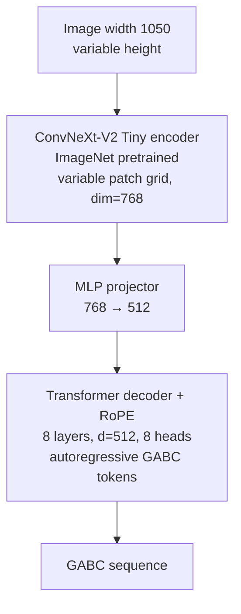

# Chant OMR — Technical Implementation Plan

End-to-end Optical Music Recognition for Gregorian chant square notation. A
vision-encoder-decoder model converts score images into [GABC](https://gregorio-project.github.io/gabc/)
notation for use in the [ghh](https://github.com/pgarciaq/ghh) ecosystem.

This document is the **technical spec**. [README.md](README.md) covers motivation
and architecture comparisons. GitHub issues [#1–#15](https://github.com/pgarciaq/chant-omr/issues)
track implementation tasks. Test strategy: [§ Testing](#testing).
Architecture decision records: [docs/adr/](docs/adr/README.md).

## Design Principles

1. **Synthetic training data first**: No manual transcription for training.
   GregoBase GABC → Gregorio renders → (image, GABC) pairs. Benchmarks are
   manual and evaluation-only.
2. **Specialist model, not VLM**: ConvNeXt-V2 + Transformer (~59M params),
   following Transcoda's proven pattern. GABC output, not `**kern` or ABC.
3. **Glyph-compositional GABC**: BPE tokenizer on GABC strings. No fixed
   neume-name classifier — GABC encodes neumes as letter sequences inside
   parentheses (see [Gregorio structure](https://gregorio-project.github.io/structure.html)).
4. **GABC, not Volpiano**: Output and training labels use GABC because it
   encodes visual neumatic glyphs and integrates with Gregorio/ghh. Volpiano
   (Cantus) encodes melodic pitch on a virtual staff — better for chant
   analysis, worse for image→notation OMR and typesetting. See
   [GABC vs Volpiano](#gabc-vs-volpiano-why-not-volpiano).
5. **Polite corpus acquisition**: Official `csv.php` catalog + targeted
   downloads. Never brute-force scan GregoBase ID ranges.
6. **Render consistency**: Match GregoBase's Gregorio stack; use
   [nomargin](https://gregorio-project.github.io/tips/nomargin.html) tight
   crops. Resize to fixed **width** (1050 px) preserving aspect ratio — no
   portrait letterboxing. See [§1.4 image sizing](#14-dataset--augmentation-chant_omrdatadasetpy-augmentationpy).
7. **Deploy via OpenVINO**: Train in PyTorch; export OpenVINO IR for ghh
   inference on Intel Arc GPU/NPU without PyTorch at runtime.

## Release milestones

High-level product stages. Actionable work stays in GitHub issues; rationale for
inference and headers is in [ADR 0012](docs/adr/0012-openvino-export-and-inference-deployment.md)
and [ADR 0013](docs/adr/0013-gabc-output-assembly-and-headers.md).

| | **v0** | **v1** |
|--|--------|--------|
| **Goal** | End-to-end pipeline works on synthetic Gregorio renders | Usable on **ghh dewarped real scans** |
| **Notation** | Plain square GABC only ([ADR 0007](docs/adr/0007-nabc-deferred-for-v0.md)) | Same; NABC remains Epic 5 |
| **Training** | GregoBase synthetic corpus; overfit gate passes | + domain augmentation ([#30](https://github.com/pgarciaq/chant-omr/issues/30)); full cloud train |
| **Quality bar** | Overfit 10 samples (loss → ~0); predict runs without error | Benchmark targets ([#14](https://github.com/pgarciaq/chant-omr/issues/14)): GED, neume accuracy |
| **Inference** | PyTorch predict (#13a) + OpenVINO export (#13b) | `ghh omr` on Arc ([#15](https://github.com/pgarciaq/chant-omr/issues/15)) |
| **GABC headers** | Minimal template (`name: OMR output;` + body) | **ghh injects metadata**; model still predicts body only |
| **Deferred** | NABC, grammar-constrained decoding ([#37](https://github.com/pgarciaq/chant-omr/issues/37)), KV cache ([#36](https://github.com/pgarciaq/chant-omr/issues/36)), HF upload | — |

**Do not add a separate ROADMAP.md** — this table plus the issue tracker and ADRs
are the roadmap. Splitting docs would duplicate the status table below and drift.

## Implementation Status

| Step | Component | Issue | Status | Tests |
|------|-----------|-------|--------|-------|
| 0 | Dev environment (venv, deps) | — | **Done** | 5 (gabc_parser) |
| 1.1 | GregoBase downloader | #5 | **Done** | 24 (gregobase) |
| 1.1c | Manifest hardening + id filenames | #17 | **Done** | (gregobase) |
| 1.2 | Gregorio renderer | #6 | **Done** | renderer |
| 1.2d | Parallel render workers + TeX cache | #31 | **Done** | renderer |
| 1.3 | BPE tokenizer | #7 | **Done** | tokenizer |
| 1.4 | Dataset (Phase A) | #8 | **Done** | dataset |
| 1.2e | Render batch reporting + skip counters | #27 | **Done** | renderer |
| 1.4b | Domain augmentation (Phase B) | #30 | Pending | — |
| 1.2f | Rendered-dir orphan cleanup | #29 | **Done** | renderer |
| 2.1 | ConvNeXt-V2 encoder | #9 | **Done** | encoder |
| 2.2 | Transformer decoder | #10 | **Done** | decoder |
| 2.3 | Model assembly | #11 | **Done** | model |
| 2.3a | Encoder padding mask in collate | #32 | **Done** | dataset |
| 3.1 | Lightning training | #12 | **Done** | lightning |
| 3.1b | Intel Arc XPU training | #38 | **Done** | device |
| 1.1b | Manifest rebuild from disk | #16 | **Done** | gregobase |
| 4.1 | Inference + export | #13 | **Done** (13a + 13b) | inference, export |
| 4.1b | Encoder attention mask in inference | #43 | **Done** | export |
| 4.2 | Benchmark evaluation | #14 | **Done** | evaluate |
| 4.3 | ghh consumer integration | #15 | Pending | — |

**Epic 5 (NABC, deferred):** [#22](https://github.com/pgarciaq/chant-omr/issues/22) ·
[#23](https://github.com/pgarciaq/chant-omr/issues/23) render ·
[#24](https://github.com/pgarciaq/chant-omr/issues/24) collapse ·
[#25](https://github.com/pgarciaq/chant-omr/issues/25) training ·
[#26](https://github.com/pgarciaq/chant-omr/issues/26) prefetch ·
[#28](https://github.com/pgarciaq/chant-omr/issues/28) docs

| Step | Component | Issue | Status | Tests |
|------|-----------|-------|--------|-------|
| 5.0 | NABC epic (policy + tracking) | #22 | **Done** | — |
| 5.1 | Full NABC rendering | #23 | Pending | — |
| 5.2 | Collapse NABC → plain GABC | #24 | Pending | — |
| 5.3 | NABC training/dataset path | #25 | Pending | — |
| 5.4 | Prefetch plain GABC twins | #26 | Pending | — |
| 5.5 | PLAN.md Epic 5 section | #28 | **Done** | — |

**Epics:** [#1 Data](https://github.com/pgarciaq/chant-omr/issues/1) ·
[#2 Model](https://github.com/pgarciaq/chant-omr/issues/2) ·
[#3 Training](https://github.com/pgarciaq/chant-omr/issues/3) ·
[#4 Eval/Deploy](https://github.com/pgarciaq/chant-omr/issues/4) ·
[#5 NABC](https://github.com/pgarciaq/chant-omr/issues/22) (deferred)

---

## Epic 1: Training Data Pipeline

### 1.1 GregoBase Downloader (`chant_omr/data/gregobase.py`)

GregoBase has no REST API. Use the official catalog export discovered in
[About comment #2067](https://gregobase.selapa.net/?page_id=2#comment-2067):

```
GET https://gregobase.selapa.net/csv.php
→ gregobase_2026-07-10_17-19.csv  (office-part, incipit, id)
~20,614 chants, 1 HTTP request
```

**Download per chant:**

```
GET https://gregobase.selapa.net/download.php?id={id}&format=gabc[&elem=N]
```

**Multi-variant chants** (Solesmes vs Vatican, etc.): when GregoBase stores
multiple GABC entries as a JSON array, bare `download.php` returns HTTP 200 with
**0 bytes**. Single-entry chants may also require `elem=1` (bare empty, elem=1
valid). Probe `elem=1`, `elem=2`, … until invalid; **deduplicate by SHA256**
(some IDs return identical bytes for bare and all `elem` values).

**`elem` loop algorithm (v0):**

1. `GET` bare URL (no `elem`).
2. `GET` `elem=1` … `elem=20` (max cap). Stop when body is empty, lacks `%%`, or
   SHA256 was already saved for this `id`.
3. Save each unique variant as `{id}.gabc` (bare) or `{id}_elem{N}.gabc`.
   GregoBase `Content-Disposition` slugs are ignored for on-disk names.
4. Record `elem: null` for bare-only successes, `elem: N` otherwise.

Verified live: `id=500` bare=0 / elem=1=714 B; `id=5000` bare=908 B (all elems
identical — save once).

**Incremental sync** (`updates.php`):

```
GET https://gregobase.selapa.net/updates.php[?days=N]
```

Returns **HTML** (not CSV/JSON). Default window: 15 days; `?days=30` works.

Parse `<a href="chant.php?id=NNNN">` from each `<li>`; collect unique IDs
(same ID may appear multiple times for edit history). Re-download all variants
for each ID. Store `last_sync_date` in manifest. Cap sync batch with
`--sync-limit` (independent of `--limit`).

**Manifest** (`data/gregobase/manifest.json`):

```json
{
  "catalog_date": "2026-07-10T17:19:00",
  "last_sync_date": "2026-07-11T12:00:00",
  "entries": [
    {
      "id": 5000,
      "elem": null,
      "office_part": "Introitus",
      "incipit": "Respice Domine",
      "filename": "5000.gabc",
      "sha256": "...",
      "size_bytes": 908,
      "status": "ok",
      "source": "live",
      "error": null
    }
  ]
}
```

| Field | Purpose |
|-------|---------|
| `office_part`, `incipit` | From `csv.php` catalog — debugging |
| `status` | `ok` or `failed` per file variant |
| `error` | HTTP code, empty body, missing `%%`, etc. |
| `size_bytes` | Detect truncated downloads |
| `source` | `live` (v0 only; archive bootstrap deferred) |

In-run resume (same ID re-fetched with matching SHA256) increments
`DownloadStats.skipped_files`; it does **not** write `status: skipped` rows.

Manifest is local state (`data/gregobase/` is gitignored). Saved atomically via
`manifest.json.tmp` → `os.replace()`. Per-ID updates use `replace_entries_for_id`
(no remove-before-download). Re-downloading an ID deletes superseded `.gabc` files
listed in the previous manifest rows for that ID.

**Mixed corpora:** trees downloaded before #17 may still have GregoBase slug
filenames; resume works via manifest paths. IDs re-fetched after #17 use id-based
names and drop orphan slugs on disk.

**GABC validation:** downloads require non-whitespace text after the final `%%`
(rejects GregoBase stubs like `name:;\n%%\n`). Re-fetch updates `status: failed`
for IDs that were previously saved as empty shells.

**Polite download (rate limiting):**

The downloader **must implement** rate limiting explicitly — GregoBase does not
throttle for you. v0 behavior:

| Control | Default | CLI override |
|---------|---------|--------------|
| Delay between `download.php` requests | 1.0 s | `--rate-limit 1.0` |
| Parallelism | None (sequential only) | — |
| Transient errors (429, 503, timeout) | Exponential backoff, 3 retries | — |
| Permanent errors (empty body, no `%%`, empty after `%%`) | Log, `status: failed`, continue | — |

`csv.php` and `updates.php` are single requests (no rate limit between them and
downloads beyond the per-download delay). At 1 req/s, a full ~20k catalog fetch
takes **~5.5 hours** — use phased runs (see below).

**Anti-blocking rules:**

| Rule | Value |
|------|-------|
| ID discovery | `csv.php` only — never scan 1..21000 |
| Rate limit | 1 req/sec default on `download.php` |
| User-Agent | `chant-omr/0.1 (+https://github.com/pgarciaq/chant-omr)` |
| Backoff | Exponential on 429/503 (3 retries) |
| Resume | Skip `status: ok` entries with matching SHA256; re-fetch `failed` |

**Crash safety:** manifest is saved after each ID via atomic replace. A hard crash
mid-ID leaves the prior manifest row intact (no remove-before-save). A crash after
writing a new `.gabc` but before manifest save may leave an extra file on disk;
resume re-downloads that ID (wasteful, not data loss).

##### #16 Manifest rebuild from disk

`chant-omr manifest rebuild` reconstructs `manifest.json` from existing `.gabc`
files when the manifest is lost, corrupt, or out of sync with disk.

**Conservative ID matching** — re-download rather than wrong match.  Only
assigns an ID when there is exactly one catalog match:

| Priority | Rule | Match source |
|----------|------|-------------|
| 1 | Filename `{id}.gabc` | Filename |
| 2 | Filename `{id}_elem{N}.gabc` | Filename |
| 3 | Normalized `(office_part, incipit)` → unique catalog row | GABC headers |
| 4 | GregoBase slug filename → unique catalog row | Filename slug |

Ambiguous or unmatched files are skipped and logged to `rebuild-unmatched.txt`.
Existing manifest is backed up to `manifest.json.bak` before overwrite.
Rebuilt entries use `source: "rebuilt"` and `last_sync_date: null`.

Normalization helpers (`normalize_incipit`, `normalize_office_part`) strip
accents, lowercase, collapse whitespace, and remove punctuation for fuzzy
header matching.  Requires one `csv.php` fetch for catalog enrichment.

**Catalog order:** `csv.php` row order is not quality-sorted — early pending IDs
often have empty metadata and stub GABC. Harmless; resume skips completed IDs.
Do not reorder (keeps runs reproducible).

**Bootstrap archives:** deferred post-v0. [GregoBaseCorpus v0.4](https://github.com/bacor/gregobasecorpus/releases/tag/v0.4)
is from **July 2020** (~6 years stale). v0 ships **live-download-only**; archive
bootstrap can be added later if needed.

**CLI (v0):**

```bash
chant-omr download                              # catalog + download missing
chant-omr download --limit 500                  # phased pending batch (recommended)
chant-omr download --sync --days 30 --limit 500 # sync recent edits + pending batch
chant-omr download --sync --sync-limit 20       # cap sync IDs only
chant-omr download --rate-limit 1.0             # seconds between download.php calls
```

**Correct usage:**

| Goal | Command |
|------|---------|
| First corpus (phased) | `chant-omr download --limit 500` (repeat until corpus bar full) |
| Stop laptop / resume | Same command — manifest saved per ID |
| Refresh recent edits | `chant-omr download --sync --days 7 --limit 100` |
| Sync only (no pending) | `chant-omr download --sync --sync-limit 50 --limit 0`¹ |

¹ `--limit 0` processes zero pending IDs; only sync entries run.

**Warning:** `chant-omr download --sync` without `--limit` downloads **all**
remaining pending IDs (~20k) after sync — ~5.5 h at 1 req/s. Always use `--limit`
for phased runs unless you intend a full corpus fetch.

**Phased first run:** use `--limit N` repeatedly; manifest resume skips completed
IDs. Example: `--limit 500` × 40 sessions, or one overnight full run (~5.5 h).

**Known quirks:**

- `download.php` injects GABC headers from DB metadata; Score field is body-only
- Hymns append extra verses from separate DB field
- Some chants fail with duplicate `Content-Disposition` without `elem` param
  (e.g. placeholder `----.gabc`); on-disk names are always id-based (#17)
- Corpus has duplicates, broken GABC, double headers — see
  [pleasefix.php](https://gregobase.selapa.net/pleasefix.php). Download everything;
  filter at render time.
- Resume stops the `elem` loop when bare variant matches manifest; inconsistent
  disk/manifest state recovery deferred to #16.

### 1.2 Gregorio Renderer (`chant_omr/data/renderer.py`)

**Stack** (match [GregoBase About](https://gregobase.selapa.net/?page_id=2)):

- Gregorio 6.x CLI (`gregorio`; renamed from `gabc2gregorio` in 5.0+)
- LuaLaTeX with `-shell-escape` (autocompile `[a]`)
- Libertinus Serif via `fontspec` (`\setmainfont{Libertinus Serif}`)
- poppler-utils (`pdftoppm`)

**Pipeline:** body-only GABC → LuaLaTeX autocompile → nomargin PDF → PNG (300 DPI default).
Resize to model input width is **#8 dataset**, not the renderer.

**Critical: tight margins.** Use Gregorio
[nomargin](https://gregorio-project.github.io/tips/nomargin.html) technique —
set `\pagewidth`/`\pageheight` to score bounding box (LuaLaTeX primitives).
Without this, rendered images have variable white padding and break the 1050×1485 resize.

v0 uses fixed `\hsize=10cm`. [shortscore](https://gregorio-project.github.io/tips/shortscore.html)
minipage for very short chants is deferred.

**Source:** manifest `status: ok` entries only (`data/gregobase/manifest.json`).
Gregorio autocompile uses **id-based work stems** (`20779.gabc`) even when on-disk
files still use pre-#17 slug names.

**GABC content:** body-only (neumes after the **last** `%%`; GregoBase often has nested
header blocks). Written with minimal `name:` header for Gregorio.

**Output layout** (id-based names, matching #17 GABC filenames):

```
data/rendered/
  5000.png
  5000.gabc          # symlink to gregobase/ (copy body-only on cross-device)
  500_elem1.png
  500_elem1.gabc
  render_failures.jsonl
```

**Failure handling:** append to `render_failures.jsonl`, skip and continue. Target >90% render
success on **plain GABC** batches. NABC notation is skipped explicitly (`NABC notation not
supported in v0`); see [Epic 5: NABC](#epic-5-nabc-notation-support-deferred). Expect
failures from broken GABC and TeX edge cases.

**Follow-up:** [#27](https://github.com/pgarciaq/chant-omr/issues/27) — render success % and
skip category counters (NABC, empty body, compile).

**CLI (v0):**

**Performance:** each score runs a full LuaLaTeX + Gregorio autocompile (~10–15 s/score
sequential per worker). Parallel auto workers ([#31](https://github.com/pgarciaq/chant-omr/issues/31))
improve **throughput**, not single-job compile time — first batch still pays cold-start cost
(LuaLaTeX + font cache). Observed on a 22-core host with auto workers and warm
``data/rendered/.texcache/``: **~1.2 s/score effective** bulk throughput (vs ~13 s/score
sequential before #31).

```bash
chant-omr render                              # auto workers (min(cpu, 8))
chant-omr render --workers 4                  # explicit parallelism
CHANT_OMR_RENDER_WORKERS_MAX=16 chant-omr render
```

Auto mode sets ``TEXMFCACHE`` under ``data/rendered/.texcache/`` so font caches are
shared across worker processes. Lower ``--dpi 200`` also helps slightly; training
resize targets width 1050 regardless.

### 1.3 BPE Tokenizer (`chant_omr/model/tokenizer.py`)

- Train on GABC **body** fields (after final `%%`) via `gabc_parser.py`
- **Plain corpus only:** exclude NABC (`is_nabc_notation()`) and empty bodies — same
  filter as renderer (#21); see [Epic 5](#epic-5-nabc-notation-support-deferred)
- Skip bodies shorter than 20 characters (clef-only stubs)
- Corpus scope: all manifest `ok` entries under `data/gregobase/` (not limited to
  rendered PNGs — more text improves BPE merges)
- Vocab size 2048 (`configs/default.yaml`)
- Special tokens: `<pad>`, `<bos>`, `<eos>`, `<unk>`
- Save to `data/tokenizer/` (`tokenizer.json` + `meta.json`)
- Inference must output full GABC: headers + `%%` + body (headers added outside tokenizer)

GABC is glyph-compositional: `(gf)` is two glyphs, not a token named "podatus".
BPE learns character/subword patterns efficiently.

**Encoding ambiguity:** Multiple valid GABC strings can represent the same visual
(salicus, porrectus flexus). Tokenizer handles all; evaluation needs tolerance.

```bash
chant-omr train-tokenizer                              # manifest ok plain GABC
chant-omr train-tokenizer --gabc-dir data/gregobase/   # explicit corpus dir
python scripts/train_tokenizer.py --vocab-size 2048      # standalone script
```

### 1.4 Dataset + Augmentation (`chant_omr/data/dataset.py`, `augmentation.py`)

Split into two issues: **Phase A** ([#8](https://github.com/pgarciaq/chant-omr/issues/8)
dataset loader) and **Phase B**
([#30](https://github.com/pgarciaq/chant-omr/issues/30) augmentation engine).

#### Phase A — Dataset ([#8](https://github.com/pgarciaq/chant-omr/issues/8))

`ChantOMRDataset` — load paired PNG + GABC, resize, tokenize, 90/10 train/val
split. Augmentation toggle wired but **off by default** until #30 ships.

**Pair discovery (PNG-first):** index `data/rendered/*.png`; require same-stem
`.gabc`. Apply `plain_gabc_reject_reason()` on the sidecar. Skip unpaired files.
Legacy slug `.gabc` orphans (no PNG) were cleaned up in
[#29](https://github.com/pgarciaq/chant-omr/issues/29) (149 files deleted).
149 PNG-only orphans (`.png` without `.gabc` sidecar) remain from older partial
render runs; these are excluded by the dataset and will be backfilled on the
next `--force` re-render pass.

**Labels:** read GABC body from the rendered sidecar via `extract_gabc_body()`
(the text Gregorio actually typeset for that PNG).

**Train/val split:** by **catalog id** (not per file) so `id` / `id_elemN`
variants do not leak across splits. Seeded shuffle for reproducibility.

#### Image sizing (decision 2026-07-11)

ghh will **not** use Stage 6 content-area cropping or portrait page padding for
OMR. The old 1050×1485 portrait assumption is **retired**.

Gregorio nomargin renders are **wide score strips** (~1182×400–1600 px for most
chants; some very long antiphons are taller). Corpus stats (2026-07-11, ~511
PNGs): median aspect ≈ 1.07 (slightly wider than tall).

| Parameter | Value | Rationale |
|-----------|-------|-----------|
| `target_width` | **1050** | Scale all images to this width; preserve aspect ratio |
| `max_height` | **1600** | Cap after scaling; covers ~90% of corpus; longer chants scale down uniformly to fit |
| Letterboxing | **None** | No white bars to fake a book page |

**ghh inference:** apply the same width-scale + `max_height` cap to dewarped
pages (full page, no content-area crop). Train and inference share one resize
policy.

**Batch collation:** images in a batch may have different heights after resize.
`collate_fn` pads to the **max height in the batch** (bottom pad only) so
tensors stack — this is batch machinery, not content-area letterboxing. Prefer
height bucketing later if padding waste becomes significant.

#### Token batching (decision 2026-07-11)

GABC labels are **variable-length** token sequences. Each `__getitem__` returns:

- `pixel_values` — `(3, H, W)` float tensor, ImageNet-normalized
- `input_ids` — tokenizer output with `<bos>` / `<eos>` (body only, no headers)
- `attention_mask` — `1` for real tokens

`collate_fn` pads `input_ids` to the longest sequence in the batch (capped at
`model.max_seq_len: 2048`). Padding uses `<pad>` (id 0); `attention_mask` marks
padding positions. Teacher-forcing shift (predict-next-token) is **#12** Lightning
module, not the dataset.

##### Token length distribution and truncation policy ([#33](https://github.com/pgarciaq/chant-omr/issues/33))

`chant-omr audit-tokens` scans the rendered corpus and reports BPE token lengths
(including `<bos>`/`<eos>`). Audit on the full 20k corpus with `vocab_size=2048`:

| Stat | Tokens |
|------|--------|
| p50 | 216 |
| p75 | 406 |
| p90 | 730 |
| p95 | 969 |
| p99 | 1691 |
| max | 7683 |
| mean | 338.5 |

**106 samples (0.53%)** exceed `max_seq_len=2048` and are silently truncated by
`collate_fn`. The longest is 7683 tokens (catalog 20499).

**Policy:** keep `max_seq_len=2048` for v0 — it covers 99.47% of the corpus.
Raising it to 4096 would cover 99.9% but doubles decoder memory. The 106
truncated chants are unusually long pieces (full Mass Propers, sequences); they
still contribute partial training signal. Revisit if full-train evaluation shows
disproportionate errors on long scores.

##### Test split policy ([#48](https://github.com/pgarciaq/chant-omr/issues/48))

A deterministic ~5% test split is held out from training and validation:

    is_test_split(catalog_id) = (catalog_id % 20 == 0)

This predicate is **stable** — adding or removing files never moves an ID
between splits (unlike RNG-shuffle splits).  All element variants of the
same catalog ID (e.g. `12345`, `12345_elem1`) stay in the same partition.

`build_datasets()` excludes test-split IDs by default.  To evaluate on the
test split:

```bash
chant-omr evaluate CKPT --benchmark-dir data/rendered/ --test-split-only
```

The remaining ~95% is split into train (90%) and val (10%) by the existing
`split_samples_by_catalog_id()` RNG shuffle (seed 42).

#### Multi-variant training samples

#5 downloads all unique variants per catalog `id` (dedupe by SHA256). #8 keeps
**all variants** as separate training samples — editorial diversity (Solesmes vs
Vatican) helps robustness. Optional `--one-variant-per-id` filter deferred unless
corpus size or edition noise becomes a problem.

#### Phase B — Augmentation ([#30](https://github.com/pgarciaq/chant-omr/issues/30))

On-the-fly domain augmentation (not pre-computed). Deferred from #8; implement in
`chant_omr/data/augmentation.py`:

| Category | Augmentations |
|----------|---------------|
| Ink & staves | Red staff hue variation, bleeding, fading, thickness |
| Substrate | Parchment texture, foxing, water stains, aging |
| Photography | Perspective skew, barrel distortion, uneven lighting |
| Degradation | Iron gall corrosion, salt deposits, humidity |
| Compression | JPEG quality 60–95% |

**What augmentation is:** randomly modifying clean Gregorio PNGs during training
so they resemble parchment manuscript photos (yellowing, foxing, skew, JPEG
artifacts, ink fade).

**When it helps:** production training on real LPA books — bridges the domain
gap between synthetic renders and photos.

**When it hurts:** if too aggressive (neumes become unreadable) or during the
#12 overfit smoke test (unnecessary complexity).

**v0 default:** `data.augment: false` in config until #30 ships; flip to `true`
when augmentation is production-ready.

### Alternative data sources (supplementary)

GregoBase is the **primary and sufficient** training corpus (~20k full GABC
transcriptions, CC0). Other sources are mirrors, tiny supplements, or poor fits
for v0 square-notation OMR:

| Source | Format | Scale | Use for chant-omr |
|--------|--------|-------|-------------------|
| **GregoBase** (live) | GABC | ~20,614 chants | **Primary** — full square-notation transcriptions |
| [GregoBaseCorpus](https://github.com/bacor/gregobasecorpus) | GABC + metadata | v0.4 (2020) | **Deferred** — stale; live download first |
| [yakub.cz export](http://yakub.cz/gregobase_export/gabc_export.tar.gz) | GABC | Dec 2022 | Deferred archive bootstrap |
| [gregorio-test](https://github.com/gregorio-project/gregorio-test) | GABC | ~hundreds | **Renderer QA** — edge-case syntax, not volume |
| Community repos (e.g. [ordinario-lincolnh-gabc](https://github.com/lbssousa/ordinario-lincolnh-gabc)) | GABC | small | Niche editions after dedup against manifest |
| [CantusCorpus](https://github.com/bacor/CantusCorpus) | Volpiano | 888k records, **~61k with melody** | **Skip v0** — see [GABC vs Volpiano](#gabc-vs-volpiano-why-not-volpiano) |
| [Corpus Monodicum](https://www.corpusmonodicum.de/) | own format | ~5k full melodies | Wrong task — medieval editorial, not square OMR |
| OMMR4all | diastematic OMR | research | **Future** medieval neume OMR, not square notation |
| Neumz, Source & Summit, Illuminare | GABC (per chant) | — | No bulk export |
| Andrew Hinkley / MusicaSacra archives | GABC | — | Mostly already in GregoBase |
| Transcoda / DeepScores datasets | modern notation | — | Wrong notation |
| ghh book photos + manual transcription | GABC | — | **Benchmarks only** (#14), not training scale |

**v0 decision:** one downloader (#5) targeting GregoBase live catalog only.
Archive bootstrap (GregoBaseCorpus / yakub.cz) deferred post-v0.

**CantusCorpus size reality** ([paper](https://transactions.ismir.net/articles/10.5334/tismir.321),
May 2025 export):

| CantusCorpus metric | Count |
|---------------------|-------|
| All chant records | 888,010 |
| With Volpiano-encoded melody | 60,588 (~7%) |
| With Volpiano melody ≥20 notes | 44,625 (~5%) |

Most Cantus rows are **manuscript catalogue entries** (feast, folio, incipit,
mode) — not transcriptions. Full melody transcription is explicitly a minority
practice in Cantus. Volpiano was introduced primarily for **melodic incipits**
([Hiley report](https://www.cambridge.org/core/journals/plainsong-and-medieval-music/article/abs/report-on-the-encoding-of-melodic-incipits-in-the-cantus-database-with-the-music-font-volpiano/77757F9557C9695A6E84076B8F4917C3)).
For usable melody labels, Cantus (~61k) is only ~3× GregoBase (~20k), not 40×.

Cantus records with `image` links point to **medieval manuscript folios**
(diastematic/neumatic notation), not modern square notation. Even if labels were
converted, the visual domain differs from Gregorio renders and from typical ghh
input (printed square-notation chant books).

---

## Epic 2: Vision-Encoder-Decoder Model

Architecture follows Transcoda (59M params), adapted for square notation + GABC.



### 2.1 Encoder (`chant_omr/model/encoder.py`)

- `convnextv2_tiny` via `timm` (`convnextv2_tiny.fcmae_ft_in22k_in1k`), ImageNet pretrained
- Input: width 1050 px, aspect-preserving height capped at 1600 (nomargin render
  or ghh dewarped page — no content-area crop, no portrait letterbox)
- Output: `(B, 768, H', W')` feature map and `(B, H'W', 768)` flattened memory for
  decoder cross-attention; patch grid **varies with image height** (stride 32;
  width 1050 → 32 columns)

```python
encoder, embed_dim, stride = build_encoder(variant="convnextv2_tiny", pretrained=True)
output = encoder(pixel_values)  # EncoderOutput: feature_map, memory, grid_size
```

### 2.2 Decoder (`chant_omr/model/decoder.py`)

- 8 layers, d_model=512, n_heads=8, d_ff=1024, Pre-LN, GELU FFN
- Causal self-attention (RoPE) + cross-attention to projected encoder memory
- Autoregressive GABC token generation; 2D sinusoidal on patches → #11
- Optional `encoder_attention_mask` (collate wiring → #32)
- ADR: [docs/adr/0006-transcoda-decoder-architecture.md](docs/adr/0006-transcoda-decoder-architecture.md)

```python
from chant_omr.model.decoder import build_decoder, DecoderConfig

decoder = build_decoder(DecoderConfig.from_mapping(config["model"]))
logits = decoder(input_ids, encoder_memory)  # (B, T, vocab_size)
```

### 2.3 Model Assembly (`chant_omr/model/chant_omr_model.py`)

- Wire encoder → **2D sinusoidal PE** → flatten → **MLP projector** (768→512) → decoder
- `ChantOMRConfig` from `configs/default.yaml`
- Target ~59M parameters ([#34](https://github.com/pgarciaq/chant-omr/issues/34))
- ADR: [docs/adr/0009-mlp-projector-and-2d-sinusoidal-bridge.md](docs/adr/0009-mlp-projector-and-2d-sinusoidal-bridge.md)

```python
from chant_omr.model.chant_omr_model import build_model, ChantOMRConfig, count_model_parameters

model = build_model(ChantOMRConfig.from_mapping(config["model"]))
logits = model(pixel_values, input_ids)  # (B, T, vocab_size)
breakdown = count_model_parameters(model)
```

---

## Epic 3: Training Loop

### 3.1 Lightning Module (`chant_omr/training/lightning_module.py`)

| Parameter | Value |
|-----------|-------|
| Optimizer | AdamW |
| Learning rate | 1e-4 |
| Weight decay | 0.05 |
| Scheduler | Cosine + linear warmup (5% steps) |
| Gradient clip | max_norm = 1.0 |
| Precision | bf16-mixed (A100) / fp16-mixed (T4) |
| Batch size | 8 (configurable) |
| Epochs | 50 (monitor val loss) |

**Overfit smoke test** (gate before cloud GPU): 10 samples, loss → near zero in
few epochs. Proves data → model → loss pipeline on local hardware.

**Cloud training:** RunPod/Lambda A100, 8–16 hours, ~$15–35 full run.

### 3.1b Intel Arc XPU training ([#38](https://github.com/pgarciaq/chant-omr/issues/38))

Native `torch.xpu` via `SingleXPUStrategy` (Lightning has no `accelerator="xpu"`).
CLI: `--accelerator auto|cuda|xpu|cpu`, `--xpu-index`. Startup log clarifies device
(Lightning's "GPU available" is CUDA-only).

**Device flags elsewhere:** `train` (#38); `predict` (#13a); `evaluate` (#14, PyTorch
checkpoint path). **Not** `render` / `download` / `train-tokenizer` (CPU-only).

---

## Epic 4: Evaluation and Deployment

### 4.1 Inference + Export

Two phases within [#13](https://github.com/pgarciaq/chant-omr/issues/13):

| Phase | Scope |
|-------|--------|
| **13a** | PyTorch `predict_gabc()`, beam search, checkpoint load, GABC assembly |
| **13b** | OpenVINO IR + safetensors export; CLI `export` |

**Device selection (13a):** `predict --device auto|cuda|xpu|cpu` — reuse training
resolver; production deploy uses OpenVINO (#15), not PyTorch XPU. See [#13](https://github.com/pgarciaq/chant-omr/issues/13).

- Beam search (width 3), repetition penalty 1.1
- Export: OpenVINO IR (primary for ghh), ONNX optional, safetensors for weights
- HuggingFace upload (`pgarciaq/chant-omr`) — **deferred**
- GABC assembly: body from model, headers per [ADR 0013](docs/adr/0013-gabc-output-assembly-and-headers.md)
- OpenVINO strategy: [ADR 0012](docs/adr/0012-openvino-export-and-inference-deployment.md)
- Deferred: grammar-constrained decoding ([#37](https://github.com/pgarciaq/chant-omr/issues/37)), KV cache ([#36](https://github.com/pgarciaq/chant-omr/issues/36))

##### 13b implementation details

`chant-omr export CHECKPOINT --format openvino|safetensors` produces deployment
artifacts in `--output-dir` (default `models/`).

**OpenVINO encoder export** traces the encoder path (ConvNeXt-V2 backbone →
2D sinusoidal positional encoding → MLP projector) to ONNX, then converts to
OpenVINO IR (`encoder.xml` + `encoder.bin`).  The exported graph is fully
static-shape at the fixed canvas size (1600 × 1050):

    pixel_values (1, 3, 1600, 1050) → encoder_memory (1, 1600, d_model)

At inference time, variable-height images are padded to the canvas and an
`encoder_attention_mask` marks valid patches — same as
`build_encoder_attention_mask` in `collate_fn`.

**Safetensors export** saves full model weights (encoder + decoder) to
`model.safetensors` for portable distribution.

Both formats write a `manifest.json` with model config, canvas size, stride,
patch count, and source checkpoint path.  `--verify` runs a parity check
(PyTorch vs OpenVINO on random input, max abs diff < 2e-3; typical ~9e-4).

##### #41 Decoder-step OpenVINO export

`chant-omr export` now also exports a **decoder single-step** IR
(`decoder.xml` + `decoder.bin`) with dynamic axes for sequence length
(``T``), encoder patch count (``N``), and encoder attention mask:

    input_ids      (1, T)              int64
    encoder_memory (1, N, d_model)     float32
    encoder_mask   (1, N)              float32    (1 = real, 0 = padding)
    → next_logits  (1, 1, vocab_size)  float32

The beam search loop was refactored into a backend-agnostic ``LogitsFunc``
callable protocol (`beam_search.py`).  Both PyTorch and OpenVINO backends
plug in as different callables — the decode logic (greedy, beam, repetition
penalty) is shared.

`ov_decode.py` provides the full PyTorch-free pipeline:
`load_openvino_models(dir)` → `ov_decode_token_ids(enc, dec, pixels, …)`.
This is the inference contract for ghh (#15).

##### #43 Encoder attention mask during inference

The ``encoder_attention_mask`` is now passed through during inference beam
search, preventing the decoder from attending to padded encoder patches.

- ``pytorch_logits_func()`` and ``ov_decoder_logits_func()`` accept the
  mask and **close over it** — the mask stays constant across all generation
  steps for one image.
- ``decode_token_ids()`` computes the mask from the image tensor shape via
  ``build_encoder_attention_mask()``.
- The OpenVINO decoder IR includes ``encoder_mask`` as a third input.

**Performance note:** without KV cache ([#36](https://github.com/pgarciaq/chant-omr/issues/36)),
each decoder step re-processes all previous tokens — O(n²) total compute.
Acceptable for v0 typical scores (~200-400 tokens).

### 4.2 Benchmark Evaluation

`chant-omr evaluate CHECKPOINT --benchmark-dir DIR` runs inference on all
(image, GABC) pairs found in the directory and reports aggregate metrics.

**Data sources** (both use the same metrics):

1. `benchmarks/{book}/page_NNN.{png,gabc}` — manually transcribed real scans
   (gold standard). See [benchmarks/README.md](benchmarks/README.md).
2. `data/rendered/*.{png,gabc}` — held-out synthetic pairs (automated,
   needs deterministic test split [#48](https://github.com/pgarciaq/chant-omr/issues/48)).

| Metric | Function | Description | Target |
|--------|----------|-------------|--------|
| GABC Edit Distance | `gabc_edit_distance()` | Symmetric Levenshtein, `max(len(pred), len(ref))` denominator | < 30% real scans |
| Neume accuracy | `neume_accuracy()` | Sequence-level edit distance on `(...)` groups | > 80% |
| Structural validity | `check_structural_validity()` | Balanced parens + clef declaration | > 95% |

**Neume** = "group of notes sung on the same syllable"
([Gregorio structure](https://gregorio-project.github.io/structure.html)).

**Known limitations (v0):**

- Neume accuracy uses raw string comparison — valid-but-different GABC
  encodings count as errors ([#47](https://github.com/pgarciaq/chant-omr/issues/47)).
- Structural validity is regex-based, not Gregorio compilation
  ([#46](https://github.com/pgarciaq/chant-omr/issues/46)).

**Stretch goals:**

- **Encoding equivalence** ([#47](https://github.com/pgarciaq/chant-omr/issues/47)):
  tolerate alternate GABC for same visual
- **Gregorio compilation check** ([#46](https://github.com/pgarciaq/chant-omr/issues/46)):
  run `gregorio` on output for definitive structural validation
- **Syllable alignment**: per [graphy.html](https://gregorio-project.github.io/graphy.html)
  vowel-centering rules (iota, digamma, diphthongs)

Reference: Transcoda achieves 18.5% OMR-NED synthetic, 64% real historical scans.

### 4.3 ghh Consumer Integration

Cross-repo work in ghh:

```bash
pip install ghh[omr]
ghh omr /path/to/processed/book --model pgarciaq/chant-omr
```

- Input: ghh Stage 0–7 output (dewarped, upright page PNGs)
- Inference: OpenVINO on Intel Arc GPU/NPU
- Output: `.gabc` files alongside PDF

---

## Epic 5: NABC Notation Support (deferred)

GitHub: [#22](https://github.com/pgarciaq/chant-omr/issues/22) (epic). **Not required for v0**
square-notation OMR or ghh. Parish/choir books (e.g. LPA scans) use plain square notation
only — NABC does not appear in those sources.

### What NABC is

**Neumes Above/Below Chant** — a modern Gregorio extension for scholarly analytical
transcriptions. Pipe syntax inside neume groups encodes adiastematic layers (St. Gallen,
Laon) alongside square notation:

```
(c4) AL(e|/ta)le(egf|toS2|/efED|...)lú(g!hwi!jv|...)ia.
```

Gregorio requires `nabc-lines: N;` in the header. Detection: `is_nabc_notation()` in
`gabc_parser.py` (closed [#21](https://github.com/pgarciaq/chant-omr/issues/21)).

### Relationship to Epic #1

| Layer | v0 behavior |
|-------|-------------|
| Download | NABC files saved like any GABC (`status: ok`) |
| Render | **Skipped** by default — message `NABC notation not supported in v0` |
| Tokenizer (#7) | **Excluded** from BPE training corpus |
| Dataset (#8) | **Excluded** — no PNG pairs for skipped NABC |

### Corpus facts (local manifest, 2026-07-11)

| Category | ~Count | Notes |
|----------|--------|-------|
| Plain GABC | 1239+ | Primary training path |
| NABC | 43 | ~2.4% of ok entries |
| NABC with plain twin (same incipit + office_part, other ID) | 36 | Prefer plain edition — do not derive from NABC |
| NABC unique (no plain incipit match) | 7 | e.g. `Alleluia (Nos qui vivimus)` |

Stripping pipes → plain GABC renders (43/43 tested) but **duplicates work** when a native
plain GregoBase file already exists.

### Design principles

1. **Default: skip NABC** at render — no change to v0 pipeline
2. **Prefer native plain GABC** over collapsed NABC ([#26](https://github.com/pgarciaq/chant-omr/issues/26) prefetch)
3. **Full NABC render** ([#23](https://github.com/pgarciaq/chant-omr/issues/23)) for scholarly use, not ghh v0
4. **Collapse to plain** ([#24](https://github.com/pgarciaq/chant-omr/issues/24)) only with
   `--only-if-plain-missing` (default on when collapse enabled)
5. **Training on NABC** ([#25](https://github.com/pgarciaq/chant-omr/issues/25)) only after explicit product decision

### Child issues

| Step | Issue | Summary |
|------|-------|---------|
| 5.1 | [#23](https://github.com/pgarciaq/chant-omr/issues/23) | `--include-nabc`, inject `nabc-lines`, nomargin PNG |
| 5.2 | [#24](https://github.com/pgarciaq/chant-omr/issues/24) | `strip_nabc_square_only()`, plain-twin guard |
| 5.3 | [#25](https://github.com/pgarciaq/chant-omr/issues/25) | Optional tokenizer/dataset path (deferred) |
| 5.4 | [#26](https://github.com/pgarciaq/chant-omr/issues/26) | Download plain catalog twin instead of deriving |
| 5.5 | [#28](https://github.com/pgarciaq/chant-omr/issues/28) | This PLAN section |

**Epic #1 related:** [#27](https://github.com/pgarciaq/chant-omr/issues/27) (Done) — render
batch now reports success %, NABC skips, missing-GABC failures, and compile
errors as separate counters. NABC entries are reclassified as skips (not
failures). `RenderFailure` records include a `category` field in
`render_failures.jsonl`.

### Out of scope

- Volpiano / manuscript adiastematic OMR from photos
- NABC in v0 model training without #25 sign-off
- Replacing GregoBase plain editions with stripped NABC

### References

- [Gregorio NABC reference (PDF)](https://gregorio-project.github.io/gregorio/en/GregorioNabcRef.pdf)
- [GregoBase NABC list](https://gregobase.selapa.net/nabc.php)

---

## GABC vs Volpiano (why not Volpiano?)

GABC is not universally "better" than Volpiano — they solve different problems.
chant-omr uses GABC because it matches the **visual OMR + Gregorio + ghh** goal.
License (Cantus CC BY-NC-SA) is **not** a blocker for non-commercial use; the
real blockers are **label format**, **corpus composition**, and **visual domain**.

| Aspect | GABC (GregoBase) | Volpiano (Cantus) |
|--------|------------------|-------------------|
| **Purpose** | Typeset square notation (Gregorio) | Index and compare melodies across manuscripts |
| **What it encodes** | Neumatic **glyphs** + text + structure | Melodic **pitch** on a virtual 4-line staff |
| **Neume shapes** | Yes — `(gf)` draws a specific podatus | **No** — Cantus states Volpiano "does not depict neume shapes as found in the original sources" |
| **Neume grouping** | Parentheses per syllable | Hyphens between neumes on same syllable |
| **Text** | Syllables inline with neume groups | Separate `full_text` / `incipit` fields |
| **Typical images** | Gregorio square-notation renders | Medieval manuscript folios (when `image` link present) |
| **Full melodies** | ~20k complete GABC files | ~61k Volpiano strings (many incipits; ≥20 notes: ~45k) |
| **Synthetic pipeline** | GABC → Gregorio → PNG (works today) | No Volpiano → square-notation renderer |
| **ghh output** | Native target format | Volpiano → GABC conversion ambiguous at inference |

### Why Cantus is not a larger training corpus

CantusCorpus advertises ~888k records, but that counts **every manuscript
occurrence** of a chant (same antiphon in 40 sources = 40 rows). Only ~7% have
any Volpiano melody at all. GregoBase's ~20k entries are nearly all **complete
square-notation transcriptions** ready for Gregorio rendering.

### Three blockers for using Cantus in chant-omr

1. **Wrong label semantics.** Volpiano encodes pitch height (`a`–`o`), not glyph
   identity. Two different neume shapes at the same pitch can yield similar
   Volpiano strings. Training would teach pitch contour, not "transcribe what you
   see." The `chant21` library converts GABC → Volpiano (lossy); Volpiano → GABC
   is the hard, ambiguous direction.

2. **Wrong visual domain.** Cantus `image` URLs are medieval manuscript pages
   (diastematic/neumatic notation on parchment). chant-omr trains on Gregorio
   **square notation** and targets ghh-processed printed chant books. These are
   different notation systems and different visual appearances.

3. **Incomplete melodies.** Many Cantus Volpiano fields are **incipits only**
   (text field marked with `*`). Full-melody transcription remains a minority
   practice per CantusCorpus authors.

### When each format wins

| Task | Best format |
|------|-------------|
| Square-notation OMR → Gregorio typesetting | **GABC** |
| Cross-manuscript melodic search / indexing | **Volpiano** |
| Medieval neume OMR on manuscript folios | **OMMR4all** / Corpus Monodicum (future project) |
| Musicological transmission analysis | Cantus metadata + Volpiano |

**Future path:** a separate medieval-neume OMR model could use Cantus image
links + Volpiano (or diastematic labels) as weak supervision. That is out of
scope for chant-omr v0, which targets square notation for the ghh pipeline.

---

## GABC Domain Reference

### Gregorio notation hierarchy

| Level | Analogy | OMR relevance |
|-------|---------|---------------|
| Neume | word | Notes on one syllable — neume accuracy metric |
| Neumatic element | syllable | Connected note group |
| Neumatic glyph | letter | Atomic visual shape |

### GABC file structure

```
name: Kyrie XVII;
mode: 6;
%%
(c4) Ky(f)ri(gf)e(h) *() e(ixhi)lé(h)i(g)son.(f) (::)
```

- Headers before `%%` — injected by GregoBase `download.php` from DB metadata
- Body after `%%` — neume groups in `(...)`, text syllables between, bar lines `(;)`

### Text–neume alignment ([graphy](https://gregorio-project.github.io/graphy.html))

- Align neumes to vowel centers in Latin syllables
- Iota: `Iesus` aligns on `e`; digamma: `qui` aligns on `i`
- Large initials shift alignment for following syllables

---

## Configuration

Primary config: [configs/default.yaml](configs/default.yaml)

| Section | Key fields |
|---------|------------|
| `data` | `gabc_dir`, `rendered_dir`, `target_width: 1050`, `max_height: 1600`, `augment: false` |
| `model` | `encoder_variant: convnextv2_tiny`, `d_model: 512`, `vocab_size: 2048` |
| `training` | `epochs: 50`, `batch_size: 8`, `learning_rate: 1e-4` |
| `inference` | `beam_width: 3`, `repetition_penalty: 1.1` |

---

## Testing

Test strategy lives in this plan; each GitHub issue has a `## Tests` checklist.
See [PLAN.md § Testing](https://github.com/pgarciaq/chant-omr/blob/master/PLAN.md#testing).

### Test pyramid

| Layer | What | Where | CI? |
|-------|------|-------|-----|
| **Unit** | Mocked I/O, pure functions, model forward passes | `tests/test_*.py` | Always |
| **Component smoke** | Gregorio render, live GregoBase fetch, training step | Manual / optional local | No |
| **Integration gate** | Overfit smoke test (#12) | `scripts/train.py` | Manual pre-GPU |
| **Evaluation** | Benchmark metrics on real scans | `scripts/evaluate.py`, `benchmarks/` | Manual post-training |
| **Cross-repo** | `ghh omr` consumer | ghh repo (#15) | Manual |

**CI policy:** `pytest` + `ruff check chant_omr tests scripts`. **No network**
in CI — mock HTTP for #5, dummy tensors for model tests. Fixtures in
`tests/fixtures/`.

### Per-step test matrix

| Step | Issue | Test file | Unit (CI) | Manual gate |
|------|-------|-----------|-----------|-------------|
| 0 | — | `test_gabc_parser.py` | 5 parser tests | — |
| 1.1 | #5 | `test_gregobase.py` | Catalog, elem, updates, manifest, rate limit | `download --limit 50` live |
| 1.2 | #6 | `test_renderer.py` | Skip if no Gregorio; fixture GABC smoke | Batch render 50 plain GABC |
| 1.2d | #31 | `test_renderer.py` | `resolve_render_workers`, parallel corpus | Bulk render with auto workers |
| 1.2e | #27 | `test_renderer.py` | `TestRenderStats` (tally, success_rate, categories) | CLI output with % and breakdown |
| 1.2f | #29 | `test_renderer.py` | `TestCleanup` (orphan detection, dry-run, delete) | `chant-omr cleanup --no-dry-run` on rendered dir |
| 1.3 | #7 | `test_tokenizer.py` | Round-trip, vocab size | Train on corpus subset |
| 1.4 | #8 | `test_dataset.py` | Shapes, split, multi-variant, collate | DataLoader batch |
| 2.1 | #9 | `test_encoder.py` | Output tensor shapes | — |
| 2.2 | #10 | `test_decoder.py` | Forward pass, causal mask | — |
| 2.3 | #11 | `test_model.py` | E2E forward, param count ~59M | — |
| 2.3a | #32 | `test_dataset.py` | Encoder padding mask in collate | Mixed-height batch |
| 3.1 | #12 | `test_lightning.py` | One training step on synthetic batch | Overfit 10 samples |
| 3.1b | #38 | `test_training_device.py` | Device/precision resolver | Overfit on Arc (`--accelerator xpu`) |
| 4.1 | #13 | `test_predict.py`, `test_export.py` | GABC output parses; export artifacts exist | Predict on rendered PNG |
| 4.2 | #14 | `test_evaluate.py` | Metrics on fixture pairs; empty dir no-op | Run on `benchmarks/` |
| 4.3 | #15 | — (ghh repo) | — | `ghh omr` end-to-end |

### #5 unit tests (`tests/test_gregobase.py`)

Fixtures in `tests/fixtures/gregobase/`: sample CSV, `updates.php` HTML snippet,
GABC response bodies (bare, elem=1, duplicate SHA).

| Test | Verifies |
|------|----------|
| `test_parse_catalog_csv` | Quoted CSV fields; empty `office-part`/`incipit` rows |
| `test_parse_catalog_date` | `Content-Disposition` filename → ISO `catalog_date` |
| `test_download_bare_success` | Valid GABC → `status: ok`, `elem: null` |
| `test_download_elem_required` | bare=0 → elem=1 succeeds |
| `test_download_elem_dedupe` | bare + elem=1 same SHA256 → one saved file |
| `test_download_multi_variant` | Distinct elem SHA256s → separate manifest entries |
| `test_download_invalid_gabc` | Empty / no `%%` → `status: failed`, run continues |
| `test_content_disposition_filename` | Parse `filename=` from header |
| `test_filename_fallback` | Missing header → `{id}[_elem{N}].gabc` |
| `test_parse_updates_html` | Unique IDs from HTML `<a href="chant.php?id=">` |
| `test_manifest_resume` | Skip `status: ok` with matching on-disk SHA256 |
| `test_rate_limit` | N requests respect `--rate-limit` delay |
| `test_retry_transient` | 503 then 200 succeeds after backoff |
| `test_limit_flag` | `--limit N` processes N incomplete catalog IDs only |

### Release gates (manual)

| Gate | When | Command / criterion |
|------|------|---------------------|
| Downloader smoke | Close #5 | `chant-omr download --limit 50` + resume on re-run |
| Renderer batch | Close #6 | >90% render success on 50 **plain** GABC files |
| Pipeline smoke | After rendered data + tokenizer; **before full cloud train** | `python scripts/train.py --overfit-n 10 --batch-size 2 --epochs 20` → loss → ~0 |
| Predict smoke | After overfit checkpoint; **#13a** | `chant-omr predict` on one rendered PNG |
| OpenVINO smoke | After overfit checkpoint; **#13b** | Export IR loads on Arc |
| Benchmark eval | Close #14 | `evaluate` prints GED + neume accuracy |
| Consumer | Close #15 | `ghh omr` writes `.gabc` on dewarped page |

---

## Development

Full matrix: [docs/DEPENDENCIES.md](docs/DEPENDENCIES.md).

```bash
python3.13 -m venv .venv && source .venv/bin/activate
pip install -e ".[dev]"
pytest
ruff check chant_omr tests scripts
```

**Fedora RPMs:**

| Package group | Packages | Purpose |
|---------------|----------|---------|
| Rendering | `texlive-gregoriotex`, `texlive-luatex`, `texlive-libertinus-fonts`, `texlive-metapost`, `poppler-utils` | Gregorio → PNG |
| Intel GPU | `intel-compute-runtime`, `oneapi-level-zero` | PyTorch XPU training, OpenVINO GPU |
| Optional | `intel-oneapi-base-toolkit` | `sycl-ls`, compilers (not required for pip PyTorch) |

```bash
sudo dnf install texlive-gregoriotex texlive-luatex texlive-libertinus-fonts \
  texlive-metapost poppler-utils
sudo dnf install intel-compute-runtime oneapi-level-zero
sudo usermod -aG render "$USER"
```

**PyTorch backend:** reinstall `torch` from CUDA, XPU, or CPU wheel index after
`pip install -e .` — see docs/DEPENDENCIES.md. Train with `--accelerator xpu` on Arc.

---

## Relationship to ghh

| | ghh | chant-omr |
|--|-----|-----------|
| Role | Photo → searchable PDF | Train OMR model |
| OMR stage | Consumer (`ghh omr`) | Producer (weights) |
| Runtime ML | OpenVINO (inference) | PyTorch (training) |
| Training data | N/A | GregoBase synthetic corpus (~20k GABC) |

ghh `PLAN.md` Future OMR section describes the consumer side. This plan covers
the training and export side.
