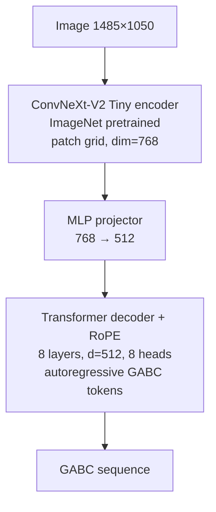

# Chant OMR — Technical Implementation Plan

End-to-end Optical Music Recognition for Gregorian chant square notation. A
vision-encoder-decoder model converts score images into [GABC](https://gregorio-project.github.io/gabc/)
notation for use in the [ghh](https://github.com/pgarciaq/ghh) ecosystem.

This document is the **technical spec**. [README.md](README.md) covers motivation
and architecture comparisons. GitHub issues [#1–#15](https://github.com/pgarciaq/chant-omr/issues)
track implementation tasks.

## Design Principles

1. **Synthetic training data first**: No manual transcription for training.
   GregoBase GABC → Gregorio renders → (image, GABC) pairs. Benchmarks are
   manual and evaluation-only.
2. **Specialist model, not VLM**: ConvNeXt-V2 + Transformer (~59M params),
   following Transcoda's proven pattern. GABC output, not `**kern` or ABC.
3. **Glyph-compositional GABC**: BPE tokenizer on GABC strings. No fixed
   neume-name classifier — GABC encodes neumes as letter sequences inside
   parentheses (see [Gregorio structure](https://gregorio-project.github.io/structure.html)).
4. **GABC, not Volpiano**: Output and training labels use GABC because it
   encodes visual neumatic glyphs and integrates with Gregorio/ghh. Volpiano
   (Cantus) encodes melodic pitch on a virtual staff — better for chant
   analysis, worse for image→notation OMR and typesetting. See
   [GABC vs Volpiano](#gabc-vs-volpiano-why-not-volpiano).
5. **Polite corpus acquisition**: Official `csv.php` catalog + targeted
   downloads. Never brute-force scan GregoBase ID ranges.
6. **Render consistency**: Match GregoBase's Gregorio stack; use
   [nomargin](https://gregorio-project.github.io/tips/nomargin.html) tight
   crops for fixed-size model input (1050×1485).
7. **Deploy via OpenVINO**: Train in PyTorch; export OpenVINO IR for ghh
   inference on Intel Arc GPU/NPU without PyTorch at runtime.

## Implementation Status

| Step | Component | Issue | Status | Tests |
|------|-----------|-------|--------|-------|
| 0 | Dev environment (venv, deps) | — | **Done** | 5 (gabc_parser) |
| 1.1 | GregoBase downloader | #5 | Pending | — |
| 1.2 | Gregorio renderer | #6 | Pending | — |
| 1.3 | BPE tokenizer | #7 | Pending | — |
| 1.4 | Dataset + augmentation | #8 | Pending | — |
| 2.1 | ConvNeXt-V2 encoder | #9 | Pending | — |
| 2.2 | Transformer decoder | #10 | Pending | — |
| 2.3 | Model assembly | #11 | Pending | — |
| 3.1 | Lightning training | #12 | Pending | — |
| 4.1 | Inference + export | #13 | Pending | — |
| 4.2 | Benchmark evaluation | #14 | Pending | — |
| 4.3 | ghh consumer integration | #15 | Pending | — |

**Epics:** [#1 Data](https://github.com/pgarciaq/chant-omr/issues/1) ·
[#2 Model](https://github.com/pgarciaq/chant-omr/issues/2) ·
[#3 Training](https://github.com/pgarciaq/chant-omr/issues/3) ·
[#4 Eval/Deploy](https://github.com/pgarciaq/chant-omr/issues/4)

---

## Epic 1: Training Data Pipeline

### 1.1 GregoBase Downloader (`chant_omr/data/gregobase.py`)

GregoBase has no REST API. Use the official catalog export discovered in
[About comment #2067](https://gregobase.selapa.net/?page_id=2#comment-2067):

```
GET https://gregobase.selapa.net/csv.php
→ gregobase_2026-07-10_17-19.csv  (office-part, incipit, id)
~20,614 chants, 1 HTTP request
```

**Download per chant:**

```
GET https://gregobase.selapa.net/download.php?id={id}&format=gabc[&elem=N]
```

**Multi-variant chants** (Solesmes vs Vatican, etc.): bare URL returns HTTP 200
with 0 bytes. Retry with `elem=1`, `elem=2`, … until empty. Save each variant
as a separate file (Content-Disposition filename).

**Incremental sync:**

```
GET https://gregobase.selapa.net/updates.php[?days=N]
→ re-download listed IDs (added/edited chants)
```

**Manifest** (`data/gregobase/manifest.json`):

```json
{
  "catalog_date": "2026-07-10T17:19:00",
  "entries": [
    {"id": 5000, "elem": 1, "filename": "in--respice_domine--dominican.gabc", "sha256": "..."}
  ]
}
```

**Anti-blocking rules:**

| Rule | Value |
|------|-------|
| ID discovery | `csv.php` only — never scan 1..21000 |
| Rate limit | 1 req/sec default on `download.php` |
| User-Agent | `chant-omr/0.1 (+https://github.com/pgarciaq/chant-omr)` |
| Backoff | Exponential on 429/503 |
| Resume | Skip existing files; compare SHA256 |

**Optional bootstrap archives** (offline copy, then `csv.php` diff for missing IDs):

| Source | Notes |
|--------|-------|
| [GregoBaseCorpus](https://github.com/bacor/gregobasecorpus) releases (preferred) | Processed GregoBase dump, CC0, maintained |
| [yakub.cz export](http://yakub.cz/gregobase_export/gabc_export.tar.gz) | Dec 2022 snapshot, ~3.9 MB — fallback only |

Live `csv.php` remains primary for freshness.

**CLI:**

```bash
chant-omr download                    # catalog + download missing
chant-omr download --sync             # also check updates.php
chant-omr download --limit 50         # dev smoke test
chant-omr download --source archive   # GregoBaseCorpus or yakub.cz bootstrap
chant-omr download --source gregobasecorpus  # explicit corpus release
```

**Known quirks:**

- `download.php` injects GABC headers from DB metadata; Score field is body-only
- Hymns append extra verses from separate DB field
- Some chants fail with duplicate `Content-Disposition` without `elem` param
- Corpus has duplicates, broken GABC, double headers — see
  [pleasefix.php](https://gregobase.selapa.net/pleasefix.php). Download everything;
  filter at render time.

### 1.2 Gregorio Renderer (`chant_omr/data/renderer.py`)

**Stack** (match [GregoBase About](https://gregobase.selapa.net/?page_id=2)):

- Gregorio 5.2.1+
- LuaLaTeX (TeX Live)
- Libertinus Serif (`\setmainfont{Libertinus Serif}`)
- poppler-utils (`pdftoppm`)

**Pipeline:** GABC → Gregorio → `.gtex` → LuaLaTeX → PDF → PNG (300 DPI default)

**Critical: tight margins.** Use Gregorio
[nomargin](https://gregorio-project.github.io/tips/nomargin.html) technique —
set `\pdfpagewidth`/`\pdfpageheight` to score bounding box. Without this,
rendered images have variable white padding and break the 1050×1485 resize.

For short chants, consider fixed `\hsize` or
[shortscore](https://gregorio-project.github.io/tips/shortscore.html) minipage
to avoid tiny scores on tall pages.

**Output layout:**

```
data/rendered/
  in--respice_domine--dominican.png
  in--respice_domine--dominican.gabc   # copy or symlink from gregobase/
```

**Failure handling:** Log and skip. Target >90% render success. Expect failures
from broken GABC, double headers, NABC scores needing `nabc-lines:1;`, TeX sections.

**GABC content:** Decide whether to render full downloaded file (with hymn verses)
or body-only (after `%%`). Document choice; body-only is simpler for OMR v0.

### 1.3 BPE Tokenizer (`chant_omr/model/tokenizer.py`)

- Train on GABC **body** fields (after `%%`) via `gabc_parser.py`
- Vocab size 2048 (`configs/default.yaml`)
- Save to `data/tokenizer/`
- Inference must output full GABC: headers + `%%` + body

GABC is glyph-compositional: `(gf)` is two glyphs, not a token named "podatus".
BPE learns character/subword patterns efficiently.

**Encoding ambiguity:** Multiple valid GABC strings can represent the same visual
(salicus, porrectus flexus). Tokenizer handles all; evaluation needs tolerance.

### 1.4 Dataset + Augmentation (`chant_omr/data/dataset.py`, `augmentation.py`)

**Phase A:** `ChantOMRDataset` — load paired PNG + GABC, resize 1050×1485,
tokenize, 90/10 train/val split.

**Phase B:** On-the-fly domain augmentation (not pre-computed):

| Category | Augmentations |
|----------|---------------|
| Ink & staves | Red staff hue variation, bleeding, fading, thickness |
| Substrate | Parchment texture, foxing, water stains, aging |
| Photography | Perspective skew, barrel distortion, uneven lighting |
| Degradation | Iron gall corrosion, salt deposits, humidity |
| Compression | JPEG quality 60–95% |

Augmentation bridges clean Gregorio renders → parchment photos. Not needed for
overfit smoke test (#12).

### Alternative data sources (supplementary)

GregoBase is the **primary and sufficient** training corpus (~20k full GABC
transcriptions, CC0). Other sources are mirrors, tiny supplements, or poor fits
for v0 square-notation OMR:

| Source | Format | Scale | Use for chant-omr |
|--------|--------|-------|-------------------|
| **GregoBase** (live) | GABC | ~20,614 chants | **Primary** — full square-notation transcriptions |
| [GregoBaseCorpus](https://github.com/bacor/gregobasecorpus) | GABC + metadata | ~same IDs | **Archive bootstrap** — prefer over yakub.cz |
| [yakub.cz export](http://yakub.cz/gregobase_export/gabc_export.tar.gz) | GABC | Dec 2022 | Offline bootstrap fallback |
| [gregorio-test](https://github.com/gregorio-project/gregorio-test) | GABC | ~hundreds | **Renderer QA** — edge-case syntax, not volume |
| Community repos (e.g. [ordinario-lincolnh-gabc](https://github.com/lbssousa/ordinario-lincolnh-gabc)) | GABC | small | Niche editions after dedup against manifest |
| [CantusCorpus](https://github.com/bacor/CantusCorpus) | Volpiano | 888k records, **~61k with melody** | **Skip v0** — see [GABC vs Volpiano](#gabc-vs-volpiano-why-not-volpiano) |
| [Corpus Monodicum](https://www.corpusmonodicum.de/) | own format | ~5k full melodies | Wrong task — medieval editorial, not square OMR |
| OMMR4all | diastematic OMR | research | **Future** medieval neume OMR, not square notation |
| Neumz, Source & Summit, Illuminare | GABC (per chant) | — | No bulk export |
| Andrew Hinkley / MusicaSacra archives | GABC | — | Mostly already in GregoBase |
| Transcoda / DeepScores datasets | modern notation | — | Wrong notation |
| ghh book photos + manual transcription | GABC | — | **Benchmarks only** (#14), not training scale |

**v0 decision:** one downloader (#5) targeting GregoBase live catalog; optional
`--source gregobasecorpus` for offline bootstrap. No second corpus pipeline.

**CantusCorpus size reality** ([paper](https://transactions.ismir.net/articles/10.5334/tismir.321),
May 2025 export):

| CantusCorpus metric | Count |
|---------------------|-------|
| All chant records | 888,010 |
| With Volpiano-encoded melody | 60,588 (~7%) |
| With Volpiano melody ≥20 notes | 44,625 (~5%) |

Most Cantus rows are **manuscript catalogue entries** (feast, folio, incipit,
mode) — not transcriptions. Full melody transcription is explicitly a minority
practice in Cantus. Volpiano was introduced primarily for **melodic incipits**
([Hiley report](https://www.cambridge.org/core/journals/plainsong-and-medieval-music/article/abs/report-on-the-encoding-of-melodic-incipits-in-the-cantus-database-with-the-music-font-volpiano/77757F9557C9695A6E84076B8F4917C3)).
For usable melody labels, Cantus (~61k) is only ~3× GregoBase (~20k), not 40×.

Cantus records with `image` links point to **medieval manuscript folios**
(diastematic/neumatic notation), not modern square notation. Even if labels were
converted, the visual domain differs from Gregorio renders and from typical ghh
input (printed square-notation chant books).

---

## Epic 2: Vision-Encoder-Decoder Model

Architecture follows Transcoda (59M params), adapted for square notation + GABC.



### 2.1 Encoder (`chant_omr/model/encoder.py`)

- `convnextv2_tiny` via `timm`, ImageNet pretrained
- Input: 1485×1050 portrait chant page (tight-cropped nomargin render)
- Output: patch embeddings for cross-attention

### 2.2 Decoder (`chant_omr/model/decoder.py`)

- 8 layers, d_model=512, n_heads=8, d_ff=1024
- Causal self-attention + cross-attention to encoder patches
- RoPE positional encoding
- Autoregressive GABC token generation

### 2.3 Model Assembly (`chant_omr/model/chant_omr_model.py`)

- Wire encoder → MLP projector → decoder
- `ChantOMRConfig` from `configs/default.yaml`
- Target ~59M parameters

---

## Epic 3: Training Loop

### 3.1 Lightning Module (`chant_omr/training/lightning_module.py`)

| Parameter | Value |
|-----------|-------|
| Optimizer | AdamW |
| Learning rate | 1e-4 |
| Weight decay | 0.05 |
| Scheduler | Cosine + linear warmup (5% steps) |
| Gradient clip | max_norm = 1.0 |
| Precision | bf16-mixed (A100) / fp16-mixed (T4) |
| Batch size | 8 (configurable) |
| Epochs | 50 (monitor val loss) |

**Overfit smoke test** (gate before cloud GPU): 10 samples, loss → near zero in
few epochs. Proves data → model → loss pipeline on local hardware.

**Cloud training:** RunPod/Lambda A100, 8–16 hours, ~$15–35 full run.

---

## Epic 4: Evaluation and Deployment

### 4.1 Inference + Export

- Beam search (width 3), repetition penalty 1.1
- Export: OpenVINO IR (primary), ONNX, safetensors
- HuggingFace: `pgarciaq/chant-omr`

### 4.2 Benchmark Evaluation

Manual pairs in `benchmarks/{book}/page_NNN.{png,gabc}` — ghh-processed pages,
never used for training. See [benchmarks/README.md](benchmarks/README.md).

| Metric | Description | Target |
|--------|-------------|--------|
| GABC Edit Distance | Normalized Levenshtein on GABC | < 30% real scans |
| Neume accuracy | Accuracy on `(...)` groups only | > 80% |
| Structural validity | % valid parseable GABC | > 95% |

**Neume** = "group of notes sung on the same syllable"
([Gregorio structure](https://gregorio-project.github.io/structure.html)).

**Stretch goals:**

- **Encoding equivalence**: tolerate alternate GABC for same visual
- **Syllable alignment**: per [graphy.html](https://gregorio-project.github.io/graphy.html)
  vowel-centering rules (iota, digamma, diphthongs)

Reference: Transcoda achieves 18.5% OMR-NED synthetic, 64% real historical scans.

### 4.3 ghh Consumer Integration

Cross-repo work in ghh:

```bash
pip install ghh[omr]
ghh omr /path/to/processed/book --model pgarciaq/chant-omr
```

- Input: ghh Stage 0–7 output (dewarped, upright page PNGs)
- Inference: OpenVINO on Intel Arc GPU/NPU
- Output: `.gabc` files alongside PDF

---

## GABC vs Volpiano (why not Volpiano?)

GABC is not universally "better" than Volpiano — they solve different problems.
chant-omr uses GABC because it matches the **visual OMR + Gregorio + ghh** goal.
License (Cantus CC BY-NC-SA) is **not** a blocker for non-commercial use; the
real blockers are **label format**, **corpus composition**, and **visual domain**.

| Aspect | GABC (GregoBase) | Volpiano (Cantus) |
|--------|------------------|-------------------|
| **Purpose** | Typeset square notation (Gregorio) | Index and compare melodies across manuscripts |
| **What it encodes** | Neumatic **glyphs** + text + structure | Melodic **pitch** on a virtual 4-line staff |
| **Neume shapes** | Yes — `(gf)` draws a specific podatus | **No** — Cantus states Volpiano "does not depict neume shapes as found in the original sources" |
| **Neume grouping** | Parentheses per syllable | Hyphens between neumes on same syllable |
| **Text** | Syllables inline with neume groups | Separate `full_text` / `incipit` fields |
| **Typical images** | Gregorio square-notation renders | Medieval manuscript folios (when `image` link present) |
| **Full melodies** | ~20k complete GABC files | ~61k Volpiano strings (many incipits; ≥20 notes: ~45k) |
| **Synthetic pipeline** | GABC → Gregorio → PNG (works today) | No Volpiano → square-notation renderer |
| **ghh output** | Native target format | Volpiano → GABC conversion ambiguous at inference |

### Why Cantus is not a larger training corpus

CantusCorpus advertises ~888k records, but that counts **every manuscript
occurrence** of a chant (same antiphon in 40 sources = 40 rows). Only ~7% have
any Volpiano melody at all. GregoBase's ~20k entries are nearly all **complete
square-notation transcriptions** ready for Gregorio rendering.

### Three blockers for using Cantus in chant-omr

1. **Wrong label semantics.** Volpiano encodes pitch height (`a`–`o`), not glyph
   identity. Two different neume shapes at the same pitch can yield similar
   Volpiano strings. Training would teach pitch contour, not "transcribe what you
   see." The `chant21` library converts GABC → Volpiano (lossy); Volpiano → GABC
   is the hard, ambiguous direction.

2. **Wrong visual domain.** Cantus `image` URLs are medieval manuscript pages
   (diastematic/neumatic notation on parchment). chant-omr trains on Gregorio
   **square notation** and targets ghh-processed printed chant books. These are
   different notation systems and different visual appearances.

3. **Incomplete melodies.** Many Cantus Volpiano fields are **incipits only**
   (text field marked with `*`). Full-melody transcription remains a minority
   practice per CantusCorpus authors.

### When each format wins

| Task | Best format |
|------|-------------|
| Square-notation OMR → Gregorio typesetting | **GABC** |
| Cross-manuscript melodic search / indexing | **Volpiano** |
| Medieval neume OMR on manuscript folios | **OMMR4all** / Corpus Monodicum (future project) |
| Musicological transmission analysis | Cantus metadata + Volpiano |

**Future path:** a separate medieval-neume OMR model could use Cantus image
links + Volpiano (or diastematic labels) as weak supervision. That is out of
scope for chant-omr v0, which targets square notation for the ghh pipeline.

---

## GABC Domain Reference

### Gregorio notation hierarchy

| Level | Analogy | OMR relevance |
|-------|---------|---------------|
| Neume | word | Notes on one syllable — neume accuracy metric |
| Neumatic element | syllable | Connected note group |
| Neumatic glyph | letter | Atomic visual shape |

### GABC file structure

```
name: Kyrie XVII;
mode: 6;
%%
(c4) Ky(f)ri(gf)e(h) *() e(ixhi)lé(h)i(g)son.(f) (::)
```

- Headers before `%%` — injected by GregoBase `download.php` from DB metadata
- Body after `%%` — neume groups in `(...)`, text syllables between, bar lines `(;)`

### Text–neume alignment ([graphy](https://gregorio-project.github.io/graphy.html))

- Align neumes to vowel centers in Latin syllables
- Iota: `Iesus` aligns on `e`; digamma: `qui` aligns on `i`
- Large initials shift alignment for following syllables

---

## Configuration

Primary config: [configs/default.yaml](configs/default.yaml)

| Section | Key fields |
|---------|------------|
| `data` | `gabc_dir`, `rendered_dir`, `target_width: 1050`, `target_height: 1485` |
| `model` | `encoder_variant: convnextv2_tiny`, `d_model: 512`, `vocab_size: 2048` |
| `training` | `epochs: 50`, `batch_size: 8`, `learning_rate: 1e-4` |
| `inference` | `beam_width: 3`, `repetition_penalty: 1.1` |

---

## Development

```bash
python3.13 -m venv .venv && source .venv/bin/activate
pip install -e ".[dev]"
pytest
ruff check chant_omr tests scripts
```

**System deps (rendering):**

```bash
sudo dnf install texlive-gregoriotex texlive-luatex poppler-utils
```

---

## Relationship to ghh

| | ghh | chant-omr |
|--|-----|-----------|
| Role | Photo → searchable PDF | Train OMR model |
| OMR stage | Consumer (`ghh omr`) | Producer (weights) |
| Runtime ML | OpenVINO (inference) | PyTorch (training) |
| Training data | N/A | GregoBase synthetic corpus (~20k GABC) |

ghh `PLAN.md` Future OMR section describes the consumer side. This plan covers
the training and export side.
