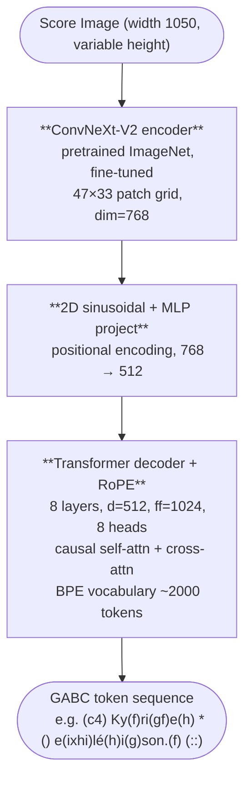
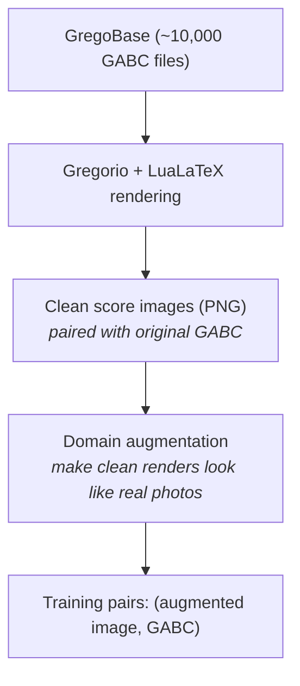

# Chant OMR

End-to-end Optical Music Recognition for Gregorian chant square notation. A vision-encoder-decoder model that converts photographs of historical chant manuscripts into [GABC](https://gregorio-project.github.io/gabc/) notation.

Part of the [Guido's Helping Hand (ghh)](https://github.com/pgarciaq/ghh) ecosystem. This repository handles model training; the trained model is consumed by ghh for inference.

## Why a Separate Project

OMR model training has fundamentally different requirements from the image processing pipeline:

| | ghh | chant-omr |
|---|---|---|
| Purpose | Process photos → searchable PDF | Train OMR model |
| Runs on | User's laptop | Cloud GPU (A100/H100) |
| Dependencies | ~200 MB (OpenCV, Pillow) | ~5 GB (PyTorch, CUDA) |
| Output | PDF files | Model weights (.safetensors) |
| Users | Anyone digitizing chant books | Model trainer (you) |

Once trained, the model is exported to OpenVINO IR and consumed by ghh's Stage 13 on any Intel hardware, without needing PyTorch at all.

## Architecture



Design follows [Transcoda](https://huggingface.co/btrkeks/transcoda-59M-zeroshot-v1) (59M params for modern notation OMR), adapted for square notation:

- Smaller decoder vocabulary (~2000 vs 3000 BPE tokens) -- square notation has ~30 neume types vs hundreds of modern symbols
- GABC output instead of `**kern` -- the native format for Gregorian chant
- Domain-specific augmentation for parchment manuscripts instead of printed scores

## Approach Comparison

### Why End-to-End (Not Classical Pipeline)

| Aspect | Classical Pipeline | End-to-End (our approach) |
|---|---|---|
| **Architecture** | Staff removal → segment → classify → assemble | Image → model → GABC |
| **Error handling** | Errors cascade between stages | Single model, joint optimization |
| **Training data** | Need bounding boxes for each symbol | Only need (image, GABC) pairs |
| **Ligatures** | Must decompose compound neumes | Learned implicitly |
| **Adaptability** | Rules per notation variant | Learns from data |
| **Effort** | Multiple hand-tuned stages | Data pipeline + one training run |
| **Downside** | Brittle, hard to maintain | Needs more training data |

### Why Not Existing Tools

| Tool | Params | Why Not |
|---|---|---|
| **[Transcoda](https://huggingface.co/btrkeks/transcoda-59M-zeroshot-v1)** | 59M | Trained on modern notation (5-line staves, round noteheads). Outputs `**kern`. **Architecture is reusable, weights are not** -- our model uses the same ConvNeXt-V2 + Transformer pattern but trained from scratch on GABC. |
| **[LEGATO](https://huggingface.co/guangyangmusic/legato)** | 943M frozen + 100M trainable | Based on Llama 3.2 11B Vision with a frozen encoder. Cannot fine-tune the vision encoder on chant without unfreezing 11B parameters (impractical). Requires ~20GB+ VRAM for inference -- won't run on Intel Arc or export to OpenVINO. Outputs ABC notation (modern music format with time/key signatures). The frozen encoder has never seen square notation and can't learn it. |
| **[MisClef](https://huggingface.co/shmrrhm/MisClef)** | UNet | Not end-to-end OMR -- it's a notehead detector that finds note positions via UNet segmentation. Doesn't produce symbolic notation at all. Would need a separate classification and sequencing pipeline on top, making it a classical pipeline with all the cascading-error problems. Modern noteheads only. |
| **[Audiveris](https://github.com/Audiveris/audiveris)** | N/A | Modern printed scores only. Java. No historical manuscript support. |
| **[OMMR4all](https://github.com/OMMR4all)** | Various | Closest match -- designed for historical manuscripts. But focused on mensural (white) notation, not square notation. Active research project, not production-ready. |
| **[Rodan](https://github.com/DDMAL/Rodan)** | N/A | McGill SIMSSA project. Legacy framework, limited maintenance. Gamera-based, not deep learning. |
| **[Kraken](https://github.com/mittagessen/kraken)** | N/A | In ghh for text OCR. Could be trained for neume recognition but not designed for music structure. |

### Why Not General-Purpose VLMs (Qwen, GLM, etc.)

We evaluated whether fine-tuning a "lightweight" general-purpose vision-language model ([Qwen](https://huggingface.co/Qwen), [Z.ai/GLM](https://huggingface.co/zai-org), etc.) would be a better approach than training a specialist OMR model. It isn't.

| | General VLM (Qwen, GLM) | Specialist OMR (our approach) |
|---|---|---|
| **Smallest variant** | ~800M params (Qwen3-0.8B) | 59M params |
| **Inference VRAM** | 2-8 GB for "small" models | < 500 MB |
| **What it learns** | Language, reasoning, world knowledge, vision | One task: image → notation |
| **Fine-tuning** | LoRA/QLoRA on frozen backbone | Full training from ImageNet init |
| **OpenVINO export** | Difficult (complex attention, KV cache, dynamic shapes) | Straightforward |
| **Runs on Intel Arc** | Painfully slow | Real-time per page |

**The experiment has already been done.** LEGATO used this exact approach (Llama 3.2 11B Vision backbone, 943M total params) and Transcoda's 59M specialist beat it decisively:

| Model | Approach | Params | OMR-NED synth | OMR-NED real scans |
|---|---|---|---|---|
| LEGATO | VLM-based (frozen Llama encoder) | 943M | 43.9% | 86.7% |
| Transcoda | Specialist (ConvNeXt-V2 + Transformer) | 59M | 18.5% | 64.0% |

The specialist is 16x smaller, 2x more accurate on synthetic data, and the gap widens on real scans. The VLM's general "knowledge" doesn't help with structured symbol recognition -- it wastes capacity on language understanding that OMR doesn't need.

VLMs would make sense for a different task (e.g., a chant assistant that answers questions about notation in natural language), but not for OMR where you need precise, structured output.

**Key insight**: the ConvNeXt-V2 encoder doesn't inherently "know" about 5-line staves -- it's pretrained on ImageNet (natural images). During OMR training it learns whatever notation you feed it. Transcoda proved this architecture works at 59M params for modern notation; we train the same architecture on square notation with GABC output. No dependency on any of these projects' code or weights.

### Encoder Comparison

| Encoder | Params | Feature Dim | Notes |
|---|---|---|---|
| ConvNeXt-V2 Pico | 9.1M | 64 | Minimum viable -- fast training, may underfit |
| ConvNeXt-V2 Nano | 15.6M | 80 | Good balance for our smaller symbol vocabulary |
| **ConvNeXt-V2 Tiny** | **28.6M** | **96** | **Transcoda's choice -- start here for comparability** |
| ConvNeXt-V2 Base | 88.7M | 128 | Overkill for ~30 neume types |
| ViT-B/16 | 86M | 768 | Alternative architecture, higher compute cost |
| Swin-T | 28M | 96 | Comparable to ConvNeXt-V2 Tiny |

Recommendation: start with **ConvNeXt-V2 Tiny** (matches Transcoda), then ablate down to Nano/Pico if results are comparable.

## Training Data Pipeline

No manual transcription is needed. Training data is generated synthetically:



### Step 1: Download GABC corpus

[GregoBase](https://gregobase.selapa.net/) has ~10,000 Gregorian chant transcriptions contributed by scholars. Additional sources include the Gregorio project samples and community GABC repositories.

```bash
python scripts/download_gregobase.py --output data/gregobase/
```

### Step 2: Render score images

[Gregorio](https://gregorio-project.github.io/) is a TeX package that typesets GABC into beautiful square notation scores. Each GABC file is rendered to a clean PNG image, creating automatic (image, GABC) training pairs.

```bash
# Fedora: Gregorio + LuaLaTeX + fonts + PDF conversion + Metapost (some scores)
sudo dnf install texlive-gregoriotex texlive-luatex texlive-libertinus-fonts \
  texlive-metapost poppler-utils

# Render all GABC files
python scripts/render_dataset.py --gabc-dir data/gregobase/ --output data/rendered/
```

### Step 3: Train BPE tokenizer

A byte-pair encoding tokenizer learns subword patterns over GABC **bodies** (the
neume text after the final `%%`). Headers are not tokenized; inference prepends
them when writing a full `.gabc` file.

```bash
chant-omr train-tokenizer
# or
python scripts/train_tokenizer.py --gabc-dir data/gregobase/ --output-dir data/tokenizer/
```

Artifacts are saved to `data/tokenizer/` (`tokenizer.json` + training metadata).
NABC notation and empty bodies are excluded from the training corpus.

### Step 4: Domain augmentation

Clean Gregorio renders look nothing like photographs of 300-year-old parchment manuscripts. Augmentation bridges this domain gap during training:

| Category | Augmentations |
|---|---|
| **Ink & staves** | Red staff hue variation, ink bleeding/fading, thickness changes |
| **Substrate** | Parchment texture overlay, foxing spots, water stains, aging yellowing |
| **Photography** | Perspective skew, barrel distortion, uneven lighting, shadows, flash hotspots |
| **Degradation** | Iron gall corrosion, salt deposits, humidity damage simulation |
| **Compression** | JPEG quality variation (60-95%) |

Augmentation is applied on-the-fly during training (not pre-computed) for maximum diversity.

### Step 5: Benchmark set (manual)

Real-world evaluation requires manually transcribing 20-30 pages from each book into GABC. These are stored in `benchmarks/` and never used for training. See [`benchmarks/README.md`](benchmarks/README.md).

## Training

### Cloud GPU (recommended)

Rent a GPU for 8-24 hours. Estimated costs for full training:

| Provider | GPU | VRAM | Time | Cost |
|---|---|---|---|---|
| [RunPod](https://www.runpod.io/) | A100 80GB | 80 GB | 8-16h | $15-30 |
| [vast.ai](https://vast.ai/) | A100 40GB | 40 GB | 12-20h | $12-25 |
| [Lambda](https://lambdalabs.com/) | A100 80GB | 80 GB | 8-16h | $20-35 |
| [Google Colab Pro](https://colab.google/) | T4 / A100 | 16-40 GB | 1-5 days | $10/month |

```bash
# On the cloud machine:
git clone https://github.com/pgarciaq/chant-omr.git
cd chant-omr
pip install -e .

# Prepare data (if not pre-uploaded)
python scripts/download_gregobase.py
python scripts/render_dataset.py
python scripts/train_tokenizer.py

# Train
python scripts/train.py --config configs/default.yaml --precision bf16-mixed
```

### Local (Intel Arc -- prototyping only)

Possible for small experiments on a subset of data. Not recommended for full training runs.

```bash
# Intel Extension for PyTorch
pip install intel-extension-for-pytorch

# Train on a small subset for debugging
python scripts/train.py --config configs/default.yaml --batch-size 2 --epochs 5
```

### Training Recipe

Following Transcoda's approach:

| Parameter | Value |
|---|---|
| Optimizer | AdamW |
| Learning rate | 1e-4 |
| Weight decay | 0.05 |
| Scheduler | Cosine with linear warmup (5% of steps) |
| Gradient clipping | max_norm = 1.0 |
| Precision | bf16-mixed (A100/H100) or fp16-mixed (T4/V100) |
| Batch size | 8-16 per GPU |
| Epochs | 50-100 (monitor val loss plateau) |

## Inference & Deployment

### Export for ghh

```bash
# Export to OpenVINO IR (for Intel Arc GPU/NPU inference)
python scripts/export_openvino.py --checkpoint checkpoints/best.ckpt --output models/

# The .xml and .bin files go into ghh's model directory
```

### Upload to HuggingFace

```bash
# Upload trained model for easy distribution
huggingface-cli upload pgarciaq/chant-omr models/ --repo-type model
```

### Use from ghh

Once the model is trained and published:

```bash
pip install ghh[omr]
ghh omr /path/to/processed/book --model pgarciaq/chant-omr
```

ghh downloads the model, runs inference via OpenVINO on the user's Intel hardware, and writes GABC files alongside the PDF.

## Documentation

- **[PLAN.md](PLAN.md)** — technical implementation plan (spec, status, GregoBase/Gregorio details)
- **[benchmarks/README.md](benchmarks/README.md)** — manual evaluation benchmark workflow
- **[GitHub Issues](https://github.com/pgarciaq/chant-omr/issues)** — tracked implementation tasks

## Project Structure

```
chant-omr/
├── pyproject.toml                # Dependencies (PyTorch, Lightning, etc.)
├── README.md
├── PLAN.md                       # Technical implementation plan
├── configs/
│   └── default.yaml              # Training hyperparameters
├── chant_omr/
│   ├── cli.py                    # CLI: train, predict, export, download, render
│   ├── data/
│   │   ├── gabc_parser.py        # Parse GABC notation files
│   │   ├── gregobase.py          # Download from GregoBase
│   │   ├── renderer.py           # GABC → image via Gregorio + LuaLaTeX
│   │   ├── augmentation.py       # Domain augmentation engine
│   │   └── dataset.py            # PyTorch Dataset
│   ├── model/
│   │   ├── encoder.py            # ConvNeXt-V2 visual encoder
│   │   ├── decoder.py            # Transformer decoder
│   │   ├── tokenizer.py          # BPE tokenizer for GABC
│   │   └── chant_omr_model.py    # Full model assembly
│   ├── training/
│   │   └── lightning_module.py   # Lightning training module
│   └── inference/
│       ├── predict.py            # Run inference on images
│       └── export.py             # Export to OpenVINO / ONNX
├── scripts/
│   ├── download_gregobase.py     # Download GABC corpus
│   ├── render_dataset.py         # Render training images
│   ├── train.py                  # Training entry point
│   ├── evaluate.py               # Benchmark evaluation
│   └── export_openvino.py        # Export for deployment
├── benchmarks/                   # Manual (image, GABC) pairs for evaluation
└── tests/
```

## Metrics

| Metric | Description | Target |
|---|---|---|
| **GABC Edit Distance** | Normalized character edit distance on GABC output | < 30% on real scans |
| **Neume Accuracy** | Accuracy on neume groups only (musical content) | > 80% |
| **Structural Validity** | % of outputs that are valid GABC | > 95% |

For reference, Transcoda achieves 18.5% OMR-NED on synthetic modern notation and 64% on real historical scans. Square notation should be easier (smaller vocabulary), but the domain gap from synthetic to parchment manuscripts is larger.

## Development

```bash
python3.13 -m venv .venv && source .venv/bin/activate
pip install -e ".[dev]"
pytest
ruff check chant_omr tests scripts
```

**System deps (rendering only):**

```bash
sudo dnf install texlive-gregoriotex texlive-luatex texlive-libertinus-fonts \
  texlive-metapost poppler-utils
```

| Package | Purpose |
|---------|---------|
| `texlive-gregoriotex` | Gregorio / `gregoriotex` (GABC → score) |
| `texlive-luatex` | `lualatex -shell-escape` (autocompile) |
| `texlive-libertinus-fonts` | Libertinus Serif via `fontspec` |
| `texlive-metapost` | `plain.mp` for scores using Metapost/luamplib |
| `poppler-utils` | `pdftoppm` (PDF → PNG) |

## License

MIT
